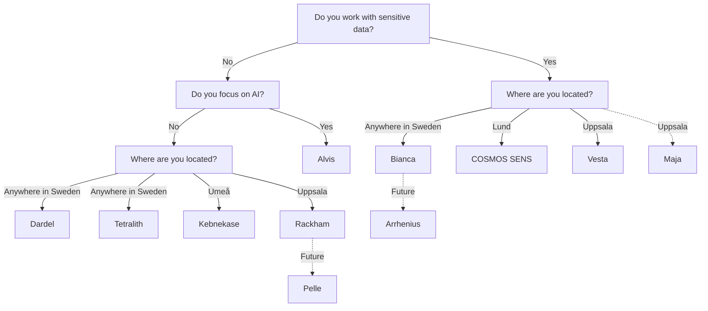

# Resources

!!! warning "This page is a stub"

    As of now, this page is incomplete, possibly incorrect and
    open for [contributions](CONTRIBUTING.md).

There are multiple types of [resources](resources.md) you may need.
This page is about finding a place to run heavy calculations on:
it shows a flowchart how to determine the computational resource
you can use, followed by an overview of all resources.

## Selecting the computational resource you can use

## Overview

<!-- markdownlint-disable MD013 --><!-- Tables cannot be split up over lines, hence will break 80 characters per line -->

HPC cluster                 | Center(s)              | Compute type    | Compute   | Storage   |Type of data        | Costs for user                                                | Accessible for       |Provider(s)
----------------------------|------------------------|-----------------|-----------|-----------|--------------------|---------------------------------------------------------------|----------------------|---------
Alvis                       | NAISS, C3SE            | AI              | Medium    | Low       | Regular            | Free                                                          | Swedish researchers  |
Bianca                      | NAISS, UPPMAX          | General purpose | Medium    | Low       | Sensitive          | Free                                                          | Swedish researchers  | 
COSMOS                      | NAISS, LUNARC          | General purpose | Medium    | Low       | Regular            | Free                                                          | Swedish researchers  | 
COSMOS SENS                 | LUNARC                 | General purpose | Medium    | Low       | Sensitive          | Free                                                          | Lund researchers     |
Dardel                      | NAISS, PDC             | General purpose | Medium    | Low       | Regular            | Free                                                          | Swedish researchers  | 
Data Science Platform       | AIDA Data Hub          | Any             | Low-Medium| Low-Medium| Any                | [Prices](https://datahub.aida.scilifelab.se/services/#prices) | Anyone               |
EOSC EU Node                | EOSC                   | General purpose | Low       | Low       | Active, regular    | Free                                                          | Researchers in Europe|.
Kebnekaise                  | HPC2N                  | General purpose | Medium    | Low       | Regular            | Free                                                          | Umeå researchers     |
Kebnekaise GPU              | HPC2N                  | General purpose | Medium    | Low       | Regular            | Free                                                          | Umeå researchers     |
Kebnekaise Large Memory     | HPC2N                  | General purpose | Medium    | Low       | Regular            | Free                                                          | Umeå researchers     |
LUMI                        | NAISS, CSC             | General purpose | High      | Low       | Regular            | Free                                                          | Swedish researchers  |
Rackham                     | NAISS, UPPMAX          | General purpose | Medium    | Low       | Regular            | Free                                                          | Uppsala researchers  ||
Sigma                       | NSC                    | General purpose | Medium    | Low       | Regular            | Free                                                          | Linköping researchers|.
Swedish Science Cloud       | NAISS                  | Hosting websites| Low       | Low       | Regular            | Free                                                          | Swedish researchers  |
Trusted research environment| Göteborg University    | General purpose | Low-Medium| Low-Medium| Any                | Free                                                          | Göteborg researchers |.
Tetralith                   | NAISS, NSC             | General purpose | Medium    | Low       | Regular            | Free                                                          | Swedish researchers  |
Vera                        | C3SE                   | General purpose | Medium    | Low       | Regular            | Free                                                          | Linköping researchers|.
Verdi                       | AIDA Data Hub          | General purpose | Low       | High      | Any type           | Depends                                                       | Anyone               |
`Unknown`                   | SND                    | None            | None      | High      | Regular            | Free                                                          | Swedish researchers  |.

<!-- markdownlint-enable MD013 -->
