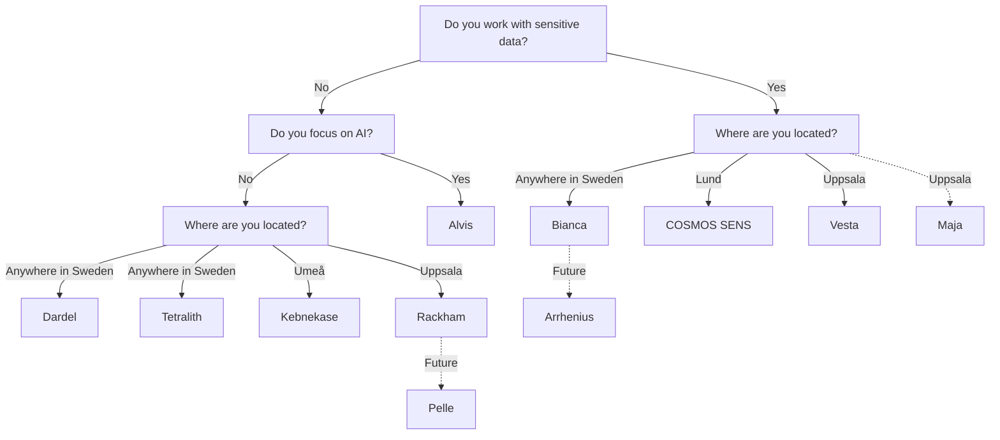

# Resources

!!! warning "This page is a stub"

    As of now, this page is incomplete, possibly incorrect and
    open for [contributions](CONTRIBUTING.md).

There are multiple types of [resources](resources.md) you may need.
This page is about finding a place to run heavy calculations on:
it shows a flowchart how to determine the computational resource
you can use, followed by an overview of all resources.

## Selecting the computational resource you can use

???- question "Why is this a useful resource?"

    This page is the only page that combines all the computational resources
    of all the different providers.

???- question "How is this list generated and updated?"

    On a daily basis,
    [the `update_content.yaml` continuous integration script](https://github.com/NBISweden/SCoRe_user_doc/blob/main/.github/workflows/update_content.yaml)
    checks the websites of the course providers and updates the list,
    using [the `scoreto` R package](https://github.com/richelbilderbeek/scoreto).

???- question "A compute provider is missing!"

    If a compute provider is missing, please [contribute](CONTRIBUTING.md)
    or [contact us](contact_us.md).

???- question "My compute resource is absent!"

    If your compute resource is absent, please [contribute](CONTRIBUTING.md)
    or [contact us](contact_us.md).

???- question "My compute resource can be displayed better!"

    If your compute resource can be displayed better,
    please [contribute](CONTRIBUTING.md)
    or [contact us](contact_us.md).

???- question "How can I read this data is a machine-friendly format?"

    Most of this information can be
    [downloaded as a `.csv`](https://raw.githubusercontent.com/NBISweden/SCoRe_user_doc/refs/heads/main/docs/compute.csv).

<!-- compute_2.md is machine-generated and pasted below this file, compute_1.md -->

|hpc_cluster                  |compute_type     |data_type |user_costs |accessible_for         |hpc_cluster_md               |logo                      |
|:----------------------------|:----------------|:---------|:----------|:----------------------|:----------------------------|:-------------------------|
|Alvis                        |AI               |Regular   |Free       |Swedish researchers    |[Alvis](https://www.c3se.chalmers.se/about/Alvis/)| |
|Bianca                       |General purpose  |Sensitive |Free       |Swedish researchers    |[Bianca](https://docs.uppmax.uu.se/cluster_guides/bianca/)| |
|COSMOS                       |General purpose  |Regular   |Free       |Swedish researchers    |[COSMOS](https://www.lunarc.lu.se/systems/cosmos/)| |
|COSMOS SENS                  |General purpose  |Sensitive |Free       |Lund researchers       |[COSMOS SENS](https://www.lunarc.lu.se/systems/cosmos-sens/)||
|Dardel                       |General purpose  |Regular   |Free       |Swedish researchers    |[Dardel](https://www.pdc.kth.se/hpc-services/computing-systems/dardel-hpc-system/dardel)| |
|Data Science Platform        |Any              |Any       |[User fee](https://datahub.aida.scilifelab.se/services/#prices)|Anyone                 |[Data Science Platform](https://datahub.aida.scilifelab.se/data-science-platform/)||
|EOSC EU Node                 |General purpose  |Regular   |Free       |Researchers in Europe  |[EOSC EU Node](https://open-science-cloud.ec.europa.eu/)||
|Kebnekaise                   |General purpose  |Regular   |Free       |Umeå researchers       |[Kebnekaise](https://www.hpc2n.umu.se/resources/hardware/kebnekaise)||
|Kebnekaise GPU               |General purpose  |Regular   |Free       |Umeå researchers       |[Kebnekaise GPU](https://www.hpc2n.umu.se/resources/hardware/kebnekaise)||
|Kebnekaise Large Memory      |General purpose  |Regular   |Free       |Umeå researchers       |[Kebnekaise Large Memory](https://www.hpc2n.umu.se/resources/hardware/kebnekaise)||
|LUMI                         |General purpose  |Regular   |Free       |Swedish researchers    |[LUMI](https://lumi-supercomputer.eu/)| |
|Rackham                      |General purpose  |Regular   |Free       |Uppsala researchers    |[Rackham](https://docs.uppmax.uu.se/cluster_guides/rackham/)| |
|Sigma                        |General purpose  |Regular   |Free       |Linköping researchers  |[Sigma](https://www.nsc.liu.se/systems/sigma/)||
|Swedish Science Cloud        |Hosting websites |Regular   |Free       |Swedish researchers    |[Swedish Science Cloud](https://cloud.snic.se/)||
|Tetralith                    |General purpose  |Regular   |Free       |Swedish researchers    |[Tetralith](https://www.nsc.liu.se/systems/tetralith/)| |
|Trusted research environment |General purpose  |Any       |Free       |Gothenburg researchers |[Trusted research environment](https://tre.gu.se/)||
|Vera                         |General purpose  |Regular   |Free       |Gothenburg researchers |[Vera](https://www.c3se.chalmers.se/about/Vera/)||
|Verdi                        |General purpose  |Any type  |Depends    |Anyone                 |[Verdi](https://datahub.aida.scilifelab.se/data-science-platform/hardware/#verdi)||
