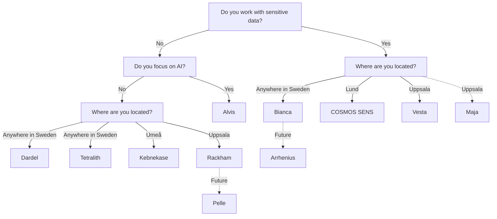

# Resources

!!! warning "This page is a stub"

    As of now, this page is incomplete, possibly incorrect and
    open for [contributions](CONTRIBUTING.md).

There are multiple types of [resources](resources.md) you may need.
This page is about finding a place to store big amounts of data.

<!-- markdownlint-disable MD013 --><!-- Tables cannot be split up over lines, hence will break 80 characters per line -->

HPC cluster           | Center(s)              | Compute type    | Compute | Storage |Type of data        | Costs for user | Accessible for
----------------------|------------------------|-----------------|---------|---------|--------------------|----------------|------
Alvis                 | NAISS, C3SE            | AI              | Medium  | Low     | Regular            | Free           | Swedish researchers
Bianca                | NAISS, UPPMAX          | General purpose | Medium  | Low     | Sensitive          | Free           | Swedish researchers
COSMOS                | NAISS, LUNARC          | General purpose | Medium  | Low     | Regular            | Free           | Swedish researchers
COSMOS SENS           | LUNARC                 | General purpose | Medium  | Low     | Sensitive          | Free           | Lund researchers
Dardel                | NAISS, PDC             | General purpose | Medium  | Low     | Regular            | Free           | Swedish researchers
Kebnekaise            | HPC2N                  | General purpose | Medium  | Low     | Regular            | Free           | Umeå researchers
LUMI                  | NAISS, CSC             | General purpose | High    | Low     | Regular            | Free           | Swedish researchers
Rackham               | NAISS, UPPMAX          | General purpose | Medium  | Low     | Regular            | Free           | Uppsala researchers
Unknown               | SND                    | None            | None    | High    | Regular            | Free           | Swedish researchers
SweStore              | NAISS                  | None            | None    | High    | Active, regular    | Free           | Swedish researchers
Swedish Science Cloud | NAISS                  | Hosting websites| Low     | Low     | Regular            | Free           | Swedish researchers
Tetralith             | NAISS, NSC             | General purpose | Medium  | Low     | Regular            | Free           | Swedish researchers
Vera                  | C3SE                   | General purpose | Medium  | Low     | Regular            | Free           | Linköping researchers
Verdi                 | AIDA Data Hub          | General purpose | Low     | High    | Any type           | Depends        | Anyone

<!-- markdownlint-enable MD013 -->

## Selecting the right resource

## Links

- [AIDA Data Hub resources](https://nbisweden.github.io/aida-datahub-docs/)
- [NBIS resources](https://nbis.se/services/computational-resources)
- [`researchdata.se`](https://researchdata.se)
