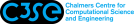
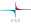

|hpc_cluster                  |compute_type     |data_type |user_costs |accessible_for         |hpc_cluster_md               |logo                      |
|:----------------------------|:----------------|:---------|:----------|:----------------------|:----------------------------|:-------------------------|
|Alvis                        |AI               |Regular   |Free       |Swedish researchers    |[Alvis](https://www.c3se.chalmers.se/about/Alvis/)| |
|Bianca                       |General purpose  |Sensitive |Free       |Swedish researchers    |[Bianca](https://docs.uppmax.uu.se/cluster_guides/bianca/)| |
|COSMOS                       |General purpose  |Regular   |Free       |Swedish researchers    |[COSMOS](https://www.lunarc.lu.se/systems/cosmos/)| |
|COSMOS SENS                  |General purpose  |Sensitive |Free       |Lund researchers       |[COSMOS SENS](https://www.lunarc.lu.se/systems/cosmos-sens/)||
|Dardel                       |General purpose  |Regular   |Free       |Swedish researchers    |[Dardel](https://www.pdc.kth.se/hpc-services/computing-systems/dardel-hpc-system/dardel)| |
|Data Science Platform        |Any              |Any       |[User fee](https://datahub.aida.scilifelab.se/services/#prices)|Anyone                 |[Data Science Platform](https://datahub.aida.scilifelab.se/data-science-platform/)||
|EOSC EU Node                 |General purpose  |Regular   |Free       |Researchers in Europe  |[EOSC EU Node](https://open-science-cloud.ec.europa.eu/)||
|Kebnekaise                   |General purpose  |Regular   |Free       |Umeå researchers       |[Kebnekaise](https://www.hpc2n.umu.se/resources/hardware/kebnekaise)||
|Kebnekaise GPU               |General purpose  |Regular   |Free       |Umeå researchers       |[Kebnekaise GPU](https://www.hpc2n.umu.se/resources/hardware/kebnekaise)||
|Kebnekaise Large Memory      |General purpose  |Regular   |Free       |Umeå researchers       |[Kebnekaise Large Memory](https://www.hpc2n.umu.se/resources/hardware/kebnekaise)||
|LUMI                         |General purpose  |Regular   |Free       |Swedish researchers    |[LUMI](https://lumi-supercomputer.eu/)| |
|Rackham                      |General purpose  |Regular   |Free       |Uppsala researchers    |[Rackham](https://docs.uppmax.uu.se/cluster_guides/rackham/)| |
|Sigma                        |General purpose  |Regular   |Free       |Linköping researchers  |[Sigma](https://www.nsc.liu.se/systems/sigma/)||
|Swedish Science Cloud        |Hosting websites |Regular   |Free       |Swedish researchers    |[Swedish Science Cloud](https://cloud.snic.se/)||
|Tetralith                    |General purpose  |Regular   |Free       |Swedish researchers    |[Tetralith](https://www.nsc.liu.se/systems/tetralith/)| |
|Trusted research environment |General purpose  |Any       |Free       |Gothenburg researchers |[Trusted research environment](https://tre.gu.se/)||
|Vera                         |General purpose  |Regular   |Free       |Gothenburg researchers |[Vera](https://www.c3se.chalmers.se/about/Vera/)||
|Verdi                        |General purpose  |Any type  |Depends    |Anyone                 |[Verdi](https://datahub.aida.scilifelab.se/data-science-platform/hardware/#verdi)||
