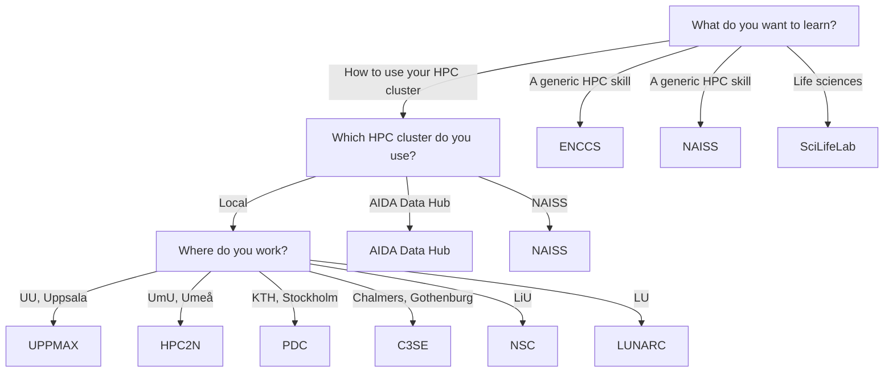

# Courses

!!! warning "This page is a stub"

    As of now, this page is incomplete, possibly incorrect and
    open for [contributions](CONTRIBUTING.md).

There are multiple types of [resources](resources.md) you may need.
Knowledge is a resource too.
This page shows the places to increase your knowledge in a learning
environment, as provided by courses and training:
it shows a flowchart how to determine the courses
you can take, followed by an overview of all resources.

## List of courses

???- question "How is this list generated and updated?"

    On a daily basis,
    [the `update_courses.yaml` continuous integration script](https://github.com/NBISweden/SCoRe_user_doc/blob/main/.github/workflows/update_courses.yaml)
    checks the websites of the course providers and updates the list,
    using [the `scoreto` R package](https://github.com/richelbilderbeek/scoreto).

<!-- courses_2.md is machine-generated and pasted below this file, courses_1.md -->

|**From**|**To**|**Course name**|**Course site**|**Provider site**|
|:----------|:----------|:---------------------------------------------------|:-----------|:------------|
|2025-02-06 |2025-02-06 |Easy to use Generative AI                                              |[Course site](https://datahub.aida.scilifelab.se/training-events/2025-02-06-easy-to-use-genai-workshop.html)|[Provider site](https://datahub.aida.scilifelab.se/training/)|
|2025-02-05 |2025-02-05 |Distributed training with Ray Toolkit                                  |[Course site](https://datahub.aida.scilifelab.se/training-events/2025-02-05-ray-toolkit-workshop.html)|[Provider site](https://datahub.aida.scilifelab.se/training/)|
|2024-09-04 |2024-09-04 |Model computational optimization                                       |[Course site](https://datahub.aida.scilifelab.se/training-events/2024-09-04-dali-workshop.html)|[Provider site](https://datahub.aida.scilifelab.se/training/)|
|2024-09-03 |2024-09-03 |Reproducible Machine Learning Research                                 |[Course site](https://datahub.aida.scilifelab.se/training-events/2024-09-03-reproducible-ml.html)|[Provider site](https://datahub.aida.scilifelab.se/training/)|
|2024-03-20 |2024-03-20 |Computation efficiency                                                 |[Course site](https://datahub.aida.scilifelab.se/training-events/2024-03-20-computational-efficency.html)|[Provider site](https://datahub.aida.scilifelab.se/training/)|
|2024-03-19 |2024-03-19 |Multimodal and constrastive learning                                   |[Course site](https://datahub.aida.scilifelab.se/training-events/2024-03-19-multimodal-and-contrastive-learning.html)|[Provider site](https://datahub.aida.scilifelab.se/training/)|
|2023-09-07 |2023-09-07 |AIDA Transformers for vision                                           |[Course site](https://datahub.aida.scilifelab.se/training-events/2023-09-07-transformer.html)|[Provider site](https://datahub.aida.scilifelab.se/training/)|
|2023-09-06 |2023-09-06 |Graph Neural Networks and Geometric Deep Learning                      |[Course site](https://datahub.aida.scilifelab.se/training-events/2023-09-06-gnns.html)|[Provider site](https://datahub.aida.scilifelab.se/training/)|
|2025-09-09 |2025-09-11 |Introduction to Data Management Practices                              |[Course site](https://uppsala.instructure.com/courses/112492)|[Provider site](https://training.scilifelab.se/events)|
|2025-09-10 |2025-09-12 |1st SciLifeLab Workshop on Microcrystal Electron Diffraction (MicroED) |[Course site](https://www.scilifelab.se/wp-content/uploads/2025/06/Program_MicroED_Workshop10-12Sept-2025_2-1.pdf)|[Provider site](https://training.scilifelab.se/events)|
|2025-09-15 |2025-09-19 |Population Genomics in Practice                                        |[Course site](https://docs.google.com/forms/d/e/1FAIpQLSfT9BIcZnqwOfvXLfXIiBLzDzZPTRXdC8b4kiogiFgJWom7PQ/viewform?usp=send_form)|[Provider site](https://training.scilifelab.se/events)|
|2025-09-22 |2025-09-26 |Epigenomics Data Analysis: from Bulk to Single Cell – ONLINE           |[Course site](https://uppsala.instructure.com/courses/112730)|[Provider site](https://training.scilifelab.se/events)|
|2025-10-06 |2025-10-31 |Omics and data-driven precision health                                 |[Course site](https://scilifelab-training.github.io/Omics_DataDriven_PrecisionHealth/2504/)|[Provider site](https://training.scilifelab.se/events)|
|2025-10-13 |2025-10-16 |Biomarker Discovery: from theory to real world examples                |[Course site](https://docs.google.com/forms/d/e/1FAIpQLSfdLPrNB1TdQ3x6cgNNNlSOMkuuH3-pFcHLMu9XBYD-Q5aYtA/viewform?usp=pp_url)|[Provider site](https://training.scilifelab.se/events)|
|2025-11-03 |2025-11-14 |Proteomics by Mass Spectrometry: When and How                          |[Course site](https://doctoralcourses.application.ki.se/fubasextern/info?kurs=K7F2522)|[Provider site](https://training.scilifelab.se/events)|
|2025-11-10 |2025-11-14 |Physiology of ion channels and their role in disease                   |[Course site](https://liu.se/en/organisation/liu/bkv/physiology-of-ion-channels-and-their-role-in-disease)|[Provider site](https://training.scilifelab.se/events)|
|2025-11-17 |2025-11-21 |Introduction to bioinformatics using NGS data                          |[Course site](https://uppsala.instructure.com/courses/112140)|[Provider site](https://training.scilifelab.se/events)|
|2025-11-24 |2025-11-28 |Introduction to Python - with application to bioinformatics            |[Course site](https://uppsala.instructure.com/courses/113769)|[Provider site](https://training.scilifelab.se/events)|

<!-- courses_2.md is machine-generated and pasted above this file, courses_3.md -->

## Centers offering courses

- [AIDA Data Hub training](https://datahub.aida.scilifelab.se/training/)
- [NAISS training](https://www.naiss.se/training/)
- [SciLifeLab training](https://training.scilifelab.se/events)
- [ENCCS training](https://enccs.se/events)
- Courses by your local HPC center

