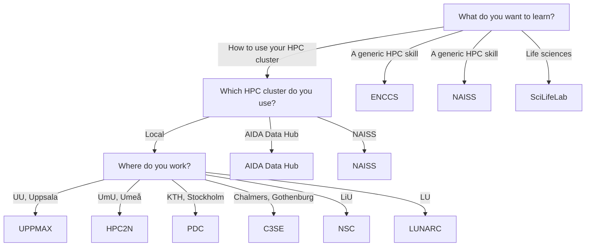

# Courses

!!! warning "This page is a stub"

    As of now, this page is incomplete, possibly incorrect and
    open for [contributions](CONTRIBUTING.md).

There are multiple types of [resources](resources.md) you may need.
Knowledge is a resource too.
This page shows the places to increase your knowledge in a learning
environment, as provided by courses and training:
it shows a flowchart how to determine the courses
you can take, followed by an overview of all resources.

## List of courses

???- question "How is this list generated and updated?"

    On a daily basis,
    [the `update_courses.yaml` continuous integration script](https://github.com/NBISweden/SCoRe_user_doc/blob/main/.github/workflows/update_courses.yaml)
    checks the websites of the course providers and updates the list,
    using [the `scoreto` R package](https://github.com/richelbilderbeek/scoreto).

<!-- courses_2.md is machine-generated and pasted below this file, courses_1.md -->

|**From**|**To**|**Course name**|**Course site**|**Provider site**|**Provider name**|
|:----------|:----------|:---------------------------------------------------|:-----------|:------------|:------------|
|2025-07-10 |2025-07-10 |Profiling AI Software Bootcamp (Online)                                              |[Course site](https://enccs.se/events/07-2025-profiling-ai-software-bootcamp/)|[Provider site](https://enccs.se/events)||
|2025-08-25 |2025-08-27 |Introduction to Linux and UPPMAX                                                     |[Course site](https://docs.uppmax.uu.se/courses_workshops/uppmax_intro_course)|[Provider site](https://docs.uppmax.uu.se/courses_workshops/courses_workshops/)||
|2025-08-28 |2025-08-29 |Awk workshop                                                                         |[Course site](https://docs.uppmax.uu.se/courses_workshops/awk/)|[Provider site](https://docs.uppmax.uu.se/courses_workshops/courses_workshops/)||
|2025-09-05 |2025-09-05 |Log in and transfer files to/from HPC Clusters                                       |[Course site](https://docs.uppmax.uu.se/courses_workshops/naiss_transfer)|[Provider site](https://docs.uppmax.uu.se/courses_workshops/courses_workshops/)||
|2025-09-08 |2025-09-08 |Introduction to Linux                                                                |[Course site](https://www.hpc2n.umu.se/events/courses/2025/fall/1/intro-linux)|[Provider site](https://www.hpc2n.umu.se/events/courses)||
|2025-09-09 |2025-09-11 |Introduction to Data Management Practices                                            |[Course site](https://uppsala.instructure.com/courses/112492)|[Provider site](https://training.scilifelab.se/events)||
|2025-09-09 |2025-09-09 |Introduction to Kebnekaise                                                           |[Course site](https://www.hpc2n.umu.se/events/courses/2025/fall/intro-kebnekaise)|[Provider site](https://www.hpc2n.umu.se/events/courses)||
|2025-09-10 |2025-09-12 |1st SciLifeLab Workshop on Microcrystal Electron Diffraction (MicroED)               |[Course site](https://www.scilifelab.se/wp-content/uploads/2025/06/Program_MicroED_Workshop10-12Sept-2025_2-1.pdf)|[Provider site](https://training.scilifelab.se/events)||
|2025-09-10 |2025-09-10 |Selecting Software Modules                                                           |[Course site](https://www.hpc2n.umu.se/events/courses/2025/fall/1/selecting-modules)|[Provider site](https://www.hpc2n.umu.se/events/courses)||
|2025-09-15 |2025-09-19 |Population Genomics in Practice                                                      |[Course site](https://docs.google.com/forms/d/e/1FAIpQLSfT9BIcZnqwOfvXLfXIiBLzDzZPTRXdC8b4kiogiFgJWom7PQ/viewform?usp=send_form)|[Provider site](https://training.scilifelab.se/events)||
|2025-09-15 |2025-09-15 |Introduction to Bianca: Handling Sensitive Research Data                             |[Course site](https://docs.uppmax.uu.se/courses_workshops/bianca_intro)|[Provider site](https://docs.uppmax.uu.se/courses_workshops/courses_workshops/)||
|2025-09-16 |2025-09-18 |Practical Machine Learning (Online)                                                  |[Course site](https://enccs.se/events/09-2025-practical-machine-learning/)|[Provider site](https://enccs.se/events)||
|2025-09-18 |2025-09-18 |Quantum-Accelerated Supercomputing for Materials Science (Webinar)                   |[Course site](https://enccs.se/events/quantum-accelerated-sc-materials-science/)|[Provider site](https://enccs.se/events)||
|2025-09-22 |2025-09-26 |Epigenomics Data Analysis: from Bulk to Single Cell – ONLINE                         |[Course site](https://uppsala.instructure.com/courses/112730)|[Provider site](https://training.scilifelab.se/events)||
|2025-10-06 |2025-10-31 |Omics and data-driven precision health                                               |[Course site](https://scilifelab-training.github.io/Omics_DataDriven_PrecisionHealth/2504/)|[Provider site](https://training.scilifelab.se/events)||
|2025-10-06 |2025-10-10 |Introduction to running R, MATLAB, and Julia in HPC                                  |[Course site](https://docs.uppmax.uu.se/courses_workshops/R_matlab_julia)|[Provider site](https://docs.uppmax.uu.se/courses_workshops/courses_workshops/)||
|2025-10-09 |2025-10-09 |HPC Workloads in the Cloud - a practical intro webinar                               |[Course site](https://enccs.se/events/10-2025-hpc-workloads-in-the-cloud/)|[Provider site](https://enccs.se/events)||
|2025-10-13 |2025-10-16 |Biomarker Discovery: from theory to real world examples                              |[Course site](https://docs.google.com/forms/d/e/1FAIpQLSfdLPrNB1TdQ3x6cgNNNlSOMkuuH3-pFcHLMu9XBYD-Q5aYtA/viewform?usp=pp_url)|[Provider site](https://training.scilifelab.se/events)||
|2025-10-13 |2025-10-13 |Basic Singularity: Running and building Singularity containers                       |[Course site](https://docs.uppmax.uu.se/courses_workshops/singularity/)|[Provider site](https://docs.uppmax.uu.se/courses_workshops/courses_workshops/)||
|2025-10-14 |2025-10-14 |Introduction to Python                                                               |[Course site](https://docs.uppmax.uu.se/courses_workshops/intro_to_python)|[Provider site](https://docs.uppmax.uu.se/courses_workshops/courses_workshops/)||
|2025-10-22 |2025-10-22 |Nordic HPC Summit 2025                                                               |[Course site](https://enccs.se/events/nordic-hpc-summit-2025/)|[Provider site](https://enccs.se/events)||
|2025-10-23 |2025-10-29 |Programming formalisms                                                               |[Course site](https://docs.uppmax.uu.se/courses_workshops/programming_formalisms)|[Provider site](https://docs.uppmax.uu.se/courses_workshops/courses_workshops/)||
|2025-11-03 |2025-11-14 |Proteomics by Mass Spectrometry: When and How                                        |[Course site](https://doctoralcourses.application.ki.se/fubasextern/info?kurs=K7F2522)|[Provider site](https://training.scilifelab.se/events)||
|2025-11-03 |2025-11-07 |Quantum Autumn School 2025                                                           |[Course site](https://enccs.se/events/qas-2025/)|[Provider site](https://enccs.se/events)||
|2025-11-10 |2025-11-14 |Physiology of ion channels and their role in disease                                 |[Course site](https://liu.se/en/organisation/liu/bkv/physiology-of-ion-channels-and-their-role-in-disease)|[Provider site](https://training.scilifelab.se/events)||
|2025-11-17 |2025-11-21 |Introduction to bioinformatics using NGS data                                        |[Course site](https://uppsala.instructure.com/courses/112140)|[Provider site](https://training.scilifelab.se/events)||
|2025-11-18 |2025-11-18 |Bianca In-Depth Workshop/Hackathon: Improve Your Handling of Sensitive Research Data |[Course site](https://docs.uppmax.uu.se/courses_workshops/bianca_intermediate)|[Provider site](https://docs.uppmax.uu.se/courses_workshops/courses_workshops/)||
|2025-11-24 |2025-11-28 |Introduction to Python - with application to bioinformatics                          |[Course site](https://uppsala.instructure.com/courses/113769)|[Provider site](https://training.scilifelab.se/events)||
|2025-11-27 |2025-11-28 |Using Python in an HPC environment part 2                                            |[Course site](https://docs.uppmax.uu.se/courses_workshops/hpc_python)|[Provider site](https://docs.uppmax.uu.se/courses_workshops/courses_workshops/)||
|2025-12-01 |2025-12-02 |Using Python in an HPC environment part 1                                            |[Course site](https://docs.uppmax.uu.se/courses_workshops/hpc_python)|[Provider site](https://docs.uppmax.uu.se/courses_workshops/courses_workshops/)||

<!-- courses_2.md is machine-generated and pasted above this file, courses_3.md -->

## Centers offering courses

- [AIDA Data Hub training](https://datahub.aida.scilifelab.se/training/)
- [NAISS training](https://www.naiss.se/training/)
- [SciLifeLab training](https://training.scilifelab.se/events)
- [ENCCS training](https://enccs.se/events)
- Courses by your local HPC center

