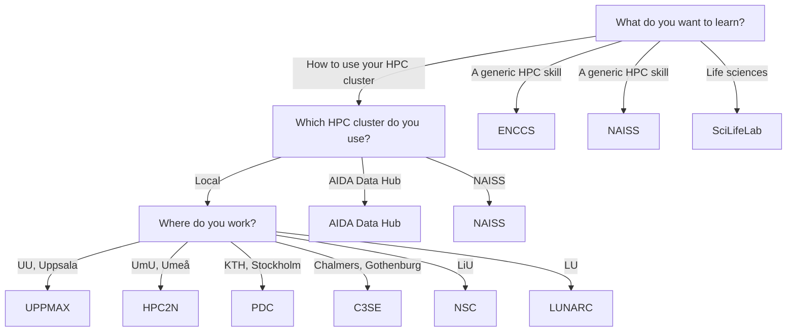

# Courses

!!! warning "This page is a stub"

    As of now, this page is incomplete, possibly incorrect and
    open for [contributions](CONTRIBUTING.md).

There are multiple types of [resources](resources.md) you may need.
Knowledge is a resource too.
This page shows the places to increase your knowledge in a learning
environment, as provided by courses and training:
it shows a flowchart how to determine the courses
you can take, followed by an overview of all resources.

## List of courses

???- question "How is this list generated and updated?"

    On a daily basis,
    [the `update_courses.yaml` continuous integration script](https://github.com/NBISweden/SCoRe_user_doc/blob/main/.github/workflows/update_courses.yaml)
    checks the websites of the course providers and updates the list,
    using [the `scoreto` R package](https://github.com/richelbilderbeek/scoreto).

<!-- courses_2.md is machine-generated and pasted below this file, courses_1.md -->

