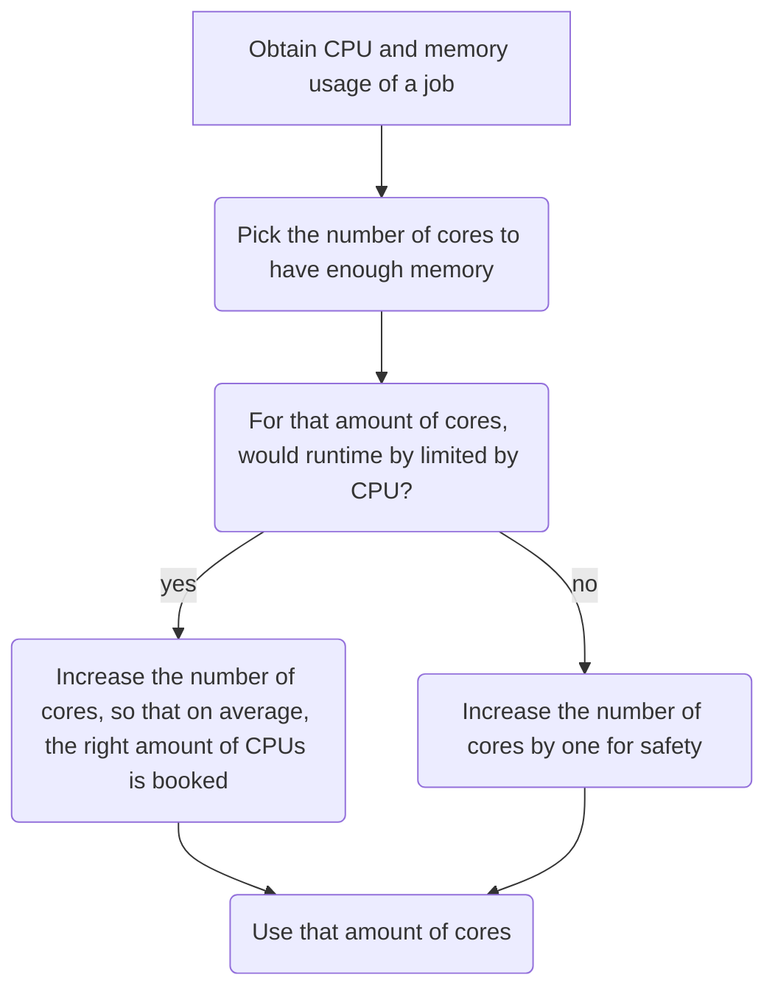

# Efficiency

!!! warning "This page is a stub"

    As of now, this page is incomplete, possibly incorrect and
    open for [contributions](CONTRIBUTING.md).

There are multiple types of [resources](resources.md) you may need.
This page is about using HPC resources efficiently,
i.e. how to schedule your HPC jobs optimally.

What is not included is how to profile computer code,
as this can be done on any local computer,
instead of the heavier [compute resources](compute.md).

???- question "How was this overview created?"

    This overview was created by going through all HPC cluster centers
    and merging the material they provided regarding this topic.

    This is the material found:

    <!-- markdownlint-disable MD013 --><!-- Tables cannot be split up over lines, hence will break 80 characters per line -->

    |HPC cluster name|Guide on how to improve efficiency|Center(s)|
    |:----------------------------|:----------------|:---------|
    |[Alvis](https://www.c3se.chalmers.se/about/Alvis/)                                      |None found                                                                                             | |
    |[Bianca](https://docs.uppmax.uu.se/cluster_guides/bianca/)                              |[UPPMAX `jobstats` page](https://docs.uppmax.uu.se/software/jobstats/#efficient-use)                   | |
    |[COSMOS](https://www.lunarc.lu.se/systems/cosmos/)                                      |None found                                                                                             | |
    |[COSMOS SENS](https://www.lunarc.lu.se/systems/cosmos-sens/)                            |None found                                                                                             ||
    |[Dardel](https://www.pdc.kth.se/hpc-services/computing-systems/dardel-hpc-system/dardel)|None found                                                                                             | |
    |[Data Science Platform](https://datahub.aida.scilifelab.se/data-science-platform/)      |None found                                                                                             ||
    |[Kebnekaise](https://www.hpc2n.umu.se/resources/hardware/kebnekaise)                    |[`job-usage`](https://hpc2n.github.io/intro-course/software/#best__practices)                          ||
    |[LUMI](https://lumi-supercomputer.eu/)                                                  |[No guide](https://lumi-supercomputer.github.io/LUMI-training-materials/2p3day-20250303/M201-Slurm/#qa)| |
    |[Rackham](https://docs.uppmax.uu.se/cluster_guides/rackham/)                            |[UPPMAX `jobstats` page](https://docs.uppmax.uu.se/software/jobstats/#efficient-use)                   | |
    |[Sigma](https://www.nsc.liu.se/systems/sigma/)                                          |None found                                                                                             ||
    |[Tetralith](https://www.nsc.liu.se/systems/tetralith/)                                  |None found                                                                                             | |
    |[Trusted research environment](https://tre.gu.se/)                                      |None found                                                                                             ||
    |[Vera](https://www.c3se.chalmers.se/about/Vera/)                                        |None found                                                                                             ||

    <!-- markdownlint-enable MD013 -->

    ???- question "My center's guide is not linked to!"

        If your center's guide is not linked to,
        please [contribute](CONTRIBUTING.md)
        or [contact us](contact_us.md).

    Additionally, searching for this topic, these sources were found too:

    - [Southern Methodist University best practices guide](https://southernmethodistuniversity.github.io/hpc_docs/tutorials/slurm/best_practices.html)
    - [Stack Overflow post on how to get the CPU and memory usage](https://stackoverflow.com/a/24087711/3364162)
    - [Blog post on using `seff` and `reportseff`](https://rse.princeton.edu/2020/01/monitoring-slurm-efficiency-with-reportseff/)

    From that, all material was merged into one.

Below is a general strategy to effectively use your HPC resources.
How this looks like in practice, depends on the tool available
on your HPC cluster.

<!-- markdownlint-disable MD013 --><!-- Mermaid nodes cannot be split up over lines, hence will break 80 characters per line -->

<!-- markdownlint-enable MD013 -->

???- question "Why not look at CPU usage?"

    Because CPU is more flexible.

    For example, imagine a job with a short CPU spike,
    that can be processed by 16 CPUs.
    If 1 core has enough memory, use 1 core of memory:
    the CPU spike will be turned into a 100% CPU use (of that one core)
    for a longer duration.

The first step, 'Obtain CPU and memory usage of a job'
depends on your HPC cluster:

|HPC cluster name|Tool and guide|Center(s)|
|:----------------------------|:----------------|:---------|
|[Alvis](https://www.c3se.chalmers.se/about/Alvis/)                                      |TODO                                            | |
|[Bianca](https://docs.uppmax.uu.se/cluster_guides/bianca/)                              |[Using `jobstats`](efficiency_using_jobstats.md)| |
|[COSMOS](https://www.lunarc.lu.se/systems/cosmos/)                                      |TODO                                            | |
|[COSMOS SENS](https://www.lunarc.lu.se/systems/cosmos-sens/)                            |TODO                                            ||
|[Dardel](https://www.pdc.kth.se/hpc-services/computing-systems/dardel-hpc-system/dardel)|TODO                                            | |
|[Data Science Platform](https://datahub.aida.scilifelab.se/data-science-platform/)      |TODO                                            ||
|[Kebnekaise](https://www.hpc2n.umu.se/resources/hardware/kebnekaise)                    |TODO                                            ||
|[LUMI](https://lumi-supercomputer.eu/)                                                  |TODO                                            | |
|[Rackham](https://docs.uppmax.uu.se/cluster_guides/rackham/)                            |[Using `jobstats`](efficiency_using_jobstats.md)| |
|[Sigma](https://www.nsc.liu.se/systems/sigma/)                                          |TODO                                            ||
|[Tetralith](https://www.nsc.liu.se/systems/tetralith/)                                  |TODO, has `seff`                                | |
|[Trusted research environment](https://tre.gu.se/)                                      |TODO                                            ||
|[Vera](https://www.c3se.chalmers.se/about/Vera/)                                        |TODO                                            ||

???- question "Need a worked-out example?"

    Worked-out examples can be found on each page specific to the tool used.
