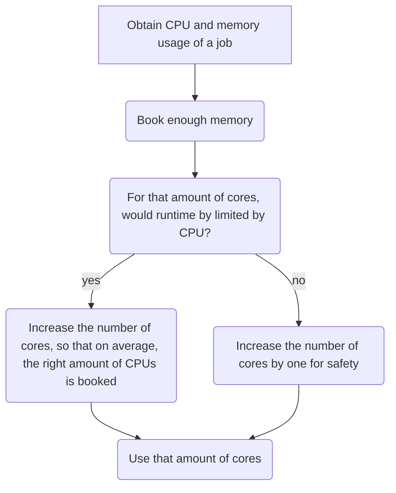

# Efficiency using a graphical representation

There are multiple tools for
[using your HPC resources efficiently](efficiency.md) you may need.

This page is about using your HPC resources efficiently
using graphical representation of the resources used for each job run
via Slurm, such as
[done by C3SE](https://www.c3se.chalmers.se/documentation/submitting_jobs/monitoring/).

Here is the general strategy to effectively use your HPC resources:

???- question "Want to see a video?"

    Watch the YouTube video
    [obtain the CPU and memory usage of a job using `Grafana`](https://youtu.be/W2sd4qsBPdQ)
    to see how to do so.

    Watch the YouTube video
    [Efficient HPC resource use, using Slurm and Grafana](https://youtu.be/0FcREXUcOHc)
    to see how the reasoning of this strategy
    works out.

<!-- markdownlint-disable MD013 --><!-- Mermaid nodes cannot be split up over lines, hence will break 80 characters per line -->



<!-- markdownlint-enable MD013 -->

???- question "Why not look at CPU usage?"

    Because CPU is more flexible.

    For example, imagine a job with a short CPU spike,
    that can be processed by 16 CPUs.
    If 1 core has enough memory, use 1 core of memory:
    the CPU spike will be turned into a 100% CPU use (of that one core)
    for a longer duration.

To obtain the CPU and memory usage of a job using `Grafana`:

```bash
job_stats.py [job_number]
```

for example:

```bash
job_stats.py 12696175
```

???- question "How does that look like?"

    This will produce output such as this:

    

???- question "Need a worked-out example?"

    

    > Book enough memory

    We see that 568 MiB is used of 62.5 GiB with 16 cores.
    We need `((568 / 62500) * 16) =` 0.15 cores to have enough
    memory. In practice, this means 1 core.

    > For that amount of cores, would runtime by limited by CPU?

    We see that on average 1.35 cores are needed. So yes, this
    means runtime is limited by CPU, so we book 2 CPU cores.

    > Increase the number of cores by one for safety

    This results in 3 CPU cores.

???- question "Need another worked-out example?"

    > Book enough memory

    .

    > For that amount of cores, would runtime by limited by CPU?

    .

    > Increase the number of cores,
    > so that on average the right amount of CPUs are booked

    .

Sometimes, however, it is inevitable to use resources
inefficiently.

## Examples

Here are some examples of how inefficient jobs can look
and what you can do to make them more efficient.

### Inefficient job example 1: booking too much cores

<!-- markdownlint-disable MD013 --><!-- Verbatim code cannot be split up over lines, hence will break 80 characters per line -->

```bash
Job ID: 12696175
Cluster: dardel
User/Group: aletyner/aletyner
State: COMPLETED (exit code 0)
Nodes: 1
Cores per node: 160
CPU Utilized: 00:00:03
CPU Efficiency: 0.00% of 1-23:22:40 core-walltime
Job Wall-clock time: 00:17:46
Memory Utilized: 4.35 GB
Memory Efficiency: 3.17% of 137.19 GB (878.00 MB/core)
The task which had the largest memory consumption differs by 102.24% from the average task max memory consumption
```

<!-- markdownlint-enable MD013 -->

Here booking 7 cores is considered okay.

> Book enough memory

In this job, only 3.17% of the memory of was used.
3.17% of 160 scheduled cores is 5.072 core.
In practice, this will be 6 cores.

> For that amount of cores, would runtime by limited by CPU?

The answer is 'no': we see a CPU efficiency of 0.00%
(i.e. 0.0049% or lower). Hence, using reducing the number
of cores to 3.17% will still be enough for the CPU.

> Increase the number of cores by one for safety

This means booking 7 cores is recommended.
