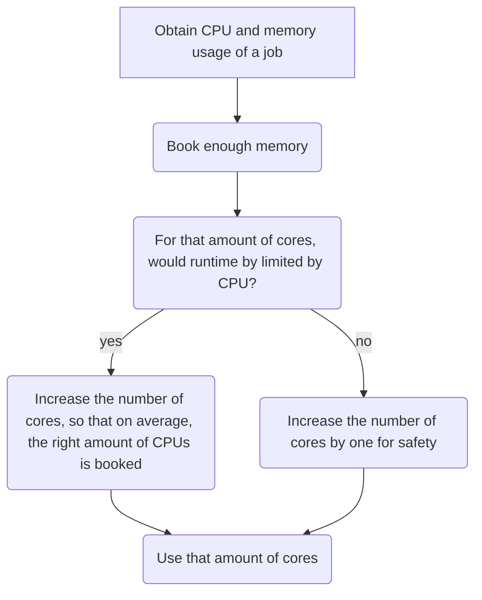

# Efficiency using `sacct`

There are multiple tools for
[using your HPC resources efficiently](efficiency.md) you may need.
This page is about using your HPC resources efficiently
using the `sacct` tool.

Here is the general strategy to effectively use your HPC resources:

???- question "Want to see a video?"

    Watch the YouTube video
    [obtain the CPU and memory usage of a job using `sacct`](https://youtu.be/W2sd4qsBPdQ)
    to see how to do so.

    Watch the YouTube video
    [Efficient HPC resource use, using Slurm and sacct](https://youtu.be/0FcREXUcOHc)
    to see how the reasoning of this strategy
    works out.

<!-- markdownlint-disable MD013 --><!-- Mermaid nodes cannot be split up over lines, hence will break 80 characters per line -->



<!-- markdownlint-enable MD013 -->

???- question "Why not look at CPU usage?"

    Because CPU is more flexible.

    For example, imagine a job with a short CPU spike,
    that can be processed by 16 CPUs.
    If 1 core has enough memory, use 1 core of memory:
    the CPU spike will be turned into a 100% CPU use (of that one core)
    for a longer duration.

To obtain the CPU and memory usage of a job using `sacct`:

<!-- markdownlint-disable MD013 --><!-- Verbatim code cannot be split up over lines, hence will break 80 characters per line -->

```bash
sacct --format=elapsed,ncpus,ntasks,UserCPU,CPUTime,AveCPU,MaxVMSize,ReqMem -j [job_number]
```

<!-- markdownlint-enable MD013 -->

for example:

<!-- markdownlint-disable MD013 --><!-- Verbatim code cannot be split up over lines, hence will break 80 characters per line -->

```bash
sacct --format=elapsed,ncpus,ntasks,UserCPU,CPUTime,AveCPU,MaxVMSize,ReqMem -j 71611
```

<!-- markdownlint-enable MD013 -->

This will produce output such as this:

<!-- markdownlint-disable MD013 --><!-- Verbatim code cannot be split up over lines, hence will break 80 characters per line -->

```bash
   Elapsed      NCPUS   NTasks    UserCPU    CPUTime     AveCPU  MaxVMSize     ReqMem
---------- ---------- -------- ---------- ---------- ---------- ---------- ----------
  00:00:13         38           00:01.615   00:08:14                          222000M
  00:00:13         38        1  00:01.615   00:08:14   00:00:00   3227532K
  00:00:13         38        1   00:00:00   00:08:14

```

<!-- markdownlint-enable MD013 -->

???- question "Need a worked-out example?"

    Here is an example output:

    <!-- markdownlint-disable MD013 --><!-- Verbatim code cannot be split up over lines, hence will break 80 characters per line -->

    ```bash
       Elapsed      NCPUS   NTasks    UserCPU    CPUTime     AveCPU  MaxVMSize     ReqMem
    ---------- ---------- -------- ---------- ---------- ---------- ---------- ----------
      00:00:13         38           00:01.615   00:08:14                          222000M
      00:00:13         38        1  00:01.615   00:08:14   00:00:00   3227532K
      00:00:13         38        1   00:00:00   00:08:14
    ```

    <!-- markdownlint-enable MD013 -->

    > Book enough memory

    There were 38 CPUs booked, which provides for 222000 megabyte
    of memory. The memory used was 3227532 kilobyte, which is around 3227
    megabyte. So we only need 3227 megabyte out of 222000 megabyte.
    `3227 / 222000 = 0.014536036 =` 1.5% of what we requested.
    1.5% of 38 CPUs is 0.6 CPU needed. Hence, booking 1 CPU will provide
    enough memory

    > For that amount of cores, would runtime by limited by CPU?

    Yes: we need 2 cores.

    On average, each of the 38 cores spent 0 seconds (i.e. max 0.049 seconds)
    working, out of 13 seconds. Using 1 core instead, means that all the work,
    0.049 seconds per core for 38 cores can be done in `0.049 * 38 =` 1.9 core.
    This means that in practice one books 2 cores.

    > Increase the number of cores by one for safety

    This would result in 3 cores.

Sometimes, however, it is inevitable to use resources
inefficiently.

## Examples

Here are some examples of how inefficient jobs can look
and what you can do to make them more efficient.

### Inefficient job example 1: booking too much cores

<!-- markdownlint-disable MD013 --><!-- Verbatim code cannot be split up over lines, hence will break 80 characters per line -->

```bash
   Elapsed      NCPUS   NTasks    UserCPU    CPUTime     AveCPU  MaxVMSize     ReqMem
---------- ---------- -------- ---------- ---------- ---------- ---------- ----------
  00:00:01         64           00:12.995   00:01:04                             375G
  00:00:01         64        1  00:12.995   00:01:04   00:00:00   3424140K
  00:00:01         64        1   00:00:00   00:01:04
```

<!-- markdownlint-enable MD013 -->

Here booking ? cores is considered okay.

> Book enough memory

There were 64 CPUs booked, which provides for 375 gigabyte
of memory. The memory used was 3424140 kilobyte, which is around 3424
megabyte. So we only need 3424 megabyte out of 375000 megabyte.
`3424 / 375000 = 0.009130667 =`0.9% of what we requested.
0.9% of 64 cores is 0.6 core needed. Hence, booking 1 core will provide
enough memory

> For that amount of cores, would runtime by limited by CPU?

    Yes: we need 2 cores.

    On average, each of the 64 cores spent 0 seconds (i.e. max 0.049 seconds)
    working, out of 1 second. Using 1 core instead, means that all the work,
    0.049 seconds per core for 64 cores can be done in `0.049 * 64 =` 3.13 core.
    This means that in practice one books 4 cores.

> Increase the number of cores by one for safety

This would result in 3 cores.
