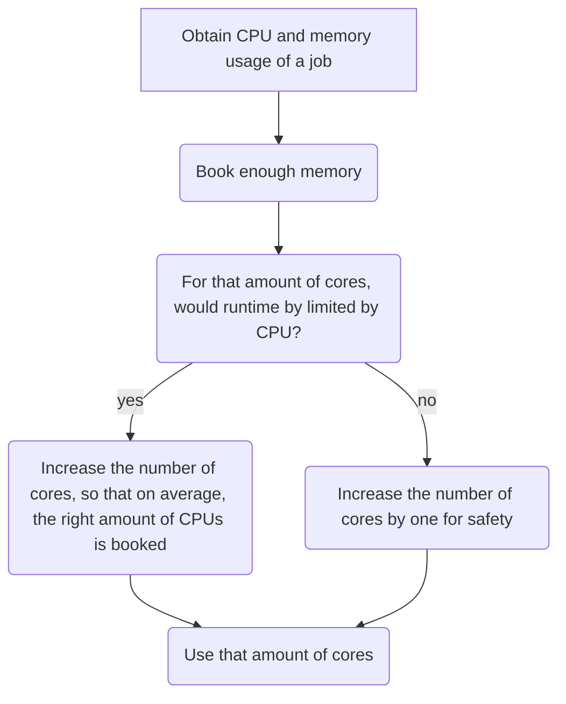

# Efficiency using `sacct`

There are multiple tools for
[using your HPC resources efficiently](efficiency.md) you may need.
This page is about using your HPC resources efficiently
using the `sacct` tool.

Here is the general strategy to effectively use your HPC resources:

???- question "Want to see a video?"

    Watch the YouTube video
    [obtain the CPU and memory usage of a job using `sacct`](https://youtu.be/W2sd4qsBPdQ)
    to see how to do so.

    Watch the YouTube video
    [Efficient HPC resource use, using Slurm and sacct](https://youtu.be/0FcREXUcOHc)
    to see how the reasoning of this strategy
    works out.

<!-- markdownlint-disable MD013 --><!-- Mermaid nodes cannot be split up over lines, hence will break 80 characters per line -->



<!-- markdownlint-enable MD013 -->

???- question "Why not look at CPU usage?"

    Because CPU is more flexible.

    For example, imagine a job with a short CPU spike,
    that can be processed by 16 CPUs.
    If 1 core has enough memory, use 1 core of memory:
    the CPU spike will be turned into a 100% CPU use (of that one core)
    for a longer duration.

To obtain the CPU and memory usage of a job using `sacct`:

```bash
sacct --format=jobid,elapsed,ncpus,ntasks,UserCPU,CPUTime,AveCPU,MaxVMSize,ReqMem -j [job_number]
```

for example:

```bash
sacct --format=jobid,elapsed,ncpus,ntasks,UserCPU,CPUTime,AveCPU,MaxVMSize,ReqMem -j 1615382
```

This will produce output such as this:


```bash
JobID           Elapsed      NCPUS   NTasks    UserCPU    CPUTime     AveCPU  MaxVMSize     ReqMem 
------------ ---------- ---------- -------- ---------- ---------- ---------- ---------- ---------- 
1615382        00:00:08         48           02:59.456   00:06:24                          254400M 
1615382.bat+   00:00:08         48        1  02:59.456   00:06:24   00:03:15    320592K            
1615382.ext+   00:00:08         48        1   00:00:00   00:06:24   00:00:00       256K            
```

???- question "Need a worked-out example?"

    .

    > Book enough memory

    .

    > For that amount of cores, would runtime by limited by CPU?

    .

    > Increase the number of cores by one for safety

    .

???- question "Need another worked-out example?"

    > Book enough memory

    .

    > For that amount of cores, would runtime by limited by CPU?

    .

    > Increase the number of cores,
    > so that on average the right amount of CPUs are booked

    .

Sometimes, however, it is inevitable to use resources
inefficiently.

## Examples

Here are some examples of how inefficient jobs can look
and what you can do to make them more efficient.

### Inefficient job example 1: booking too much cores

```bash

```

Here booking 7 cores is considered okay.

> Book enough memory

In this job, only 3.17% of the memory of was used.
3.17% of 160 scheduled cores is 5.072 core.
In practice, this will be 6 cores.

> For that amount of cores, would runtime by limited by CPU?

The answer is 'no': we see a CPU efficiency of 0.00%
(i.e. 0.0049% or lower). Hence, using reducing the number
of cores to 3.17% will still be enough for the CPU.

> Increase the number of cores by one for safety

This means booking 7 cores is recommended.

