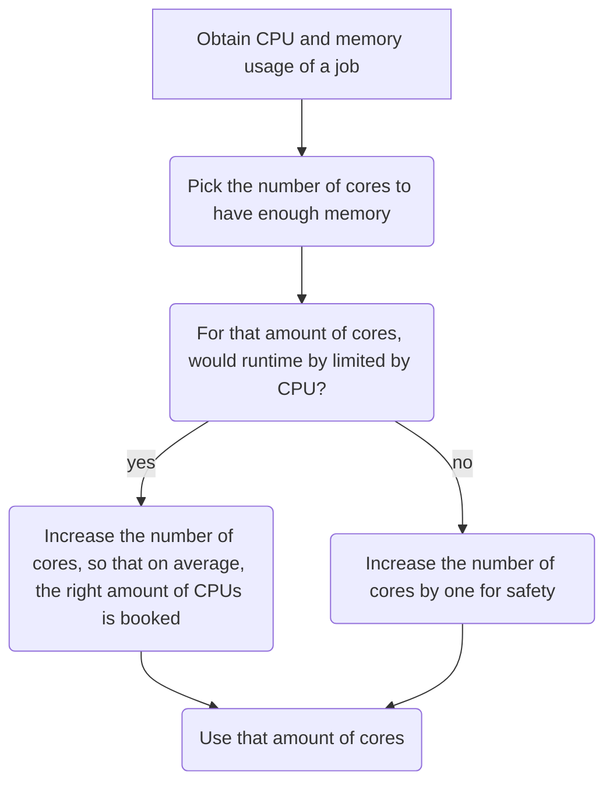
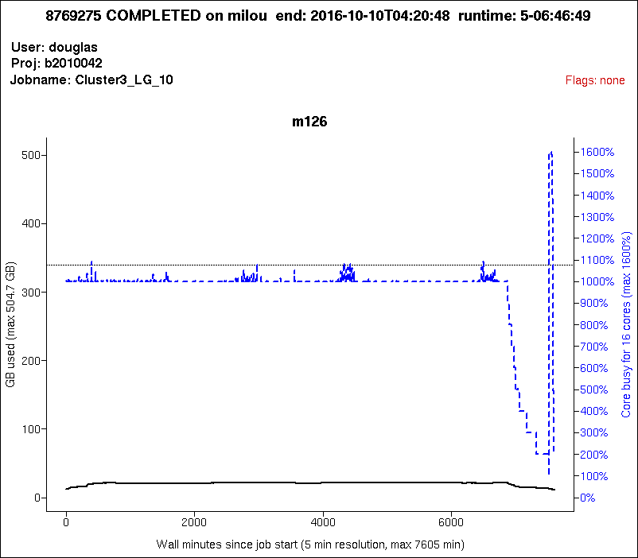
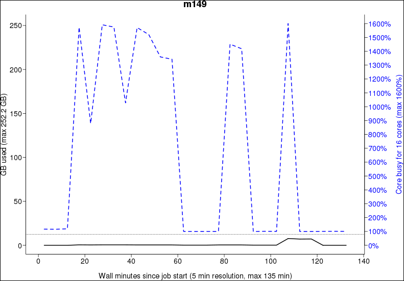
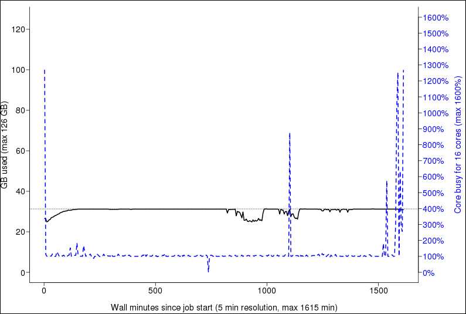
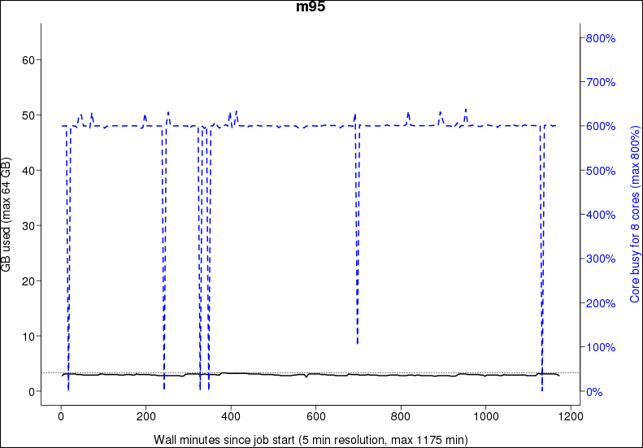
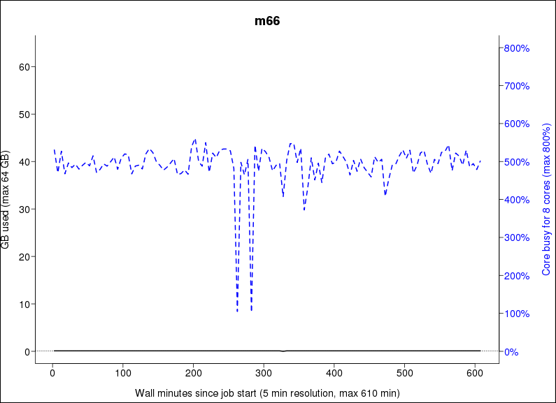
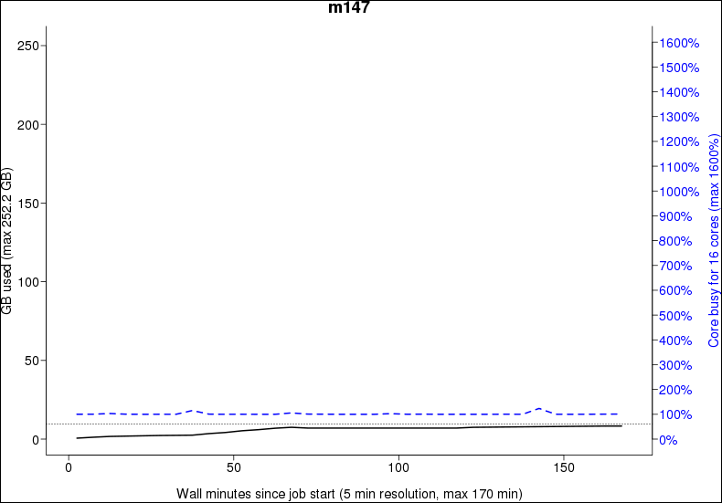

# Efficiency using `jobstats`

There are multiple tools for
[using your HPC resources efficiently](efficiency.md) you may need.
This page is about using your HPC resources efficiently
using the `jobstats` tool.

Here is the general strategy to effectively use your HPC resources:

???- question "Want to see a video?"

    Watch the YouTube video
    [obtain the CPU and memory usage of a job using `jobstats`](https://youtu.be/W2sd4qsBPdQ)
    to see how to do so.

    Watch the YouTube video
    [Efficient HPC resource use, using Slurm and jobstats](https://youtu.be/0FcREXUcOHc)
    to see how the reasoning of this strategy
    works out.

<!-- markdownlint-disable MD013 --><!-- Mermaid nodes cannot be split up over lines, hence will break 80 characters per line -->



<!-- markdownlint-enable MD013 -->

???- question "Why not look at CPU usage?"

    Because CPU is more flexible.

    For example, imagine a job with a short CPU spike,
    that can be processed by 16 CPUs.
    If 1 core has enough memory, use 1 core of memory:
    the CPU spike will be turned into a 100% CPU use (of that one core)
    for a longer duration.

To obtain the CPU and memory usage of a job using `jobstats`:

```bash
jobstats --plot [job_id]
```

for example:

```bash
jobstats --plot 12345678
```

A plot is produced showing the resource use per node
for a job that completed successfully and took longer than 5 minutes.

The produced plot will be produced in the local folder
with name
`[cluster_name]-[project_name]-[user_name]-[jobid].png`,
for example `rackham-uppmax1234-sven-876543.png`.
Use any image viewer, e.g. `eog`.

Each plot shows:

- detailed information in the title.
- CPU usage in blue
- current memory usage in solid black
- overall memory usage in dotted black (if available)

???- question "Need a worked-out example?"

    

    > Pick the number of cores to have enough memory

    The dotted black line hits the right-hand vertical axis at 1070%.
    This means that 11 cores (i.e. 1100%) would be enough for this job.

    > For that amount of cores, would runtime by limited by CPU?

    The answer is 'no'. Having 11 cores would
    mean that most of the time only 10 are used.
    Only in the CPU spike at the end, the runtime is limited by CPU.
    This short time only has a minor impact on the runtime speed.

    > Increase the number of cores by one for safety

    This means booking 12 cores is recommended.

???- question "Need another worked-out example?"

    

    > Pick the number of cores to have enough memory

    The dotted black line hits the right-hand vertical axis at 90%.
    This means that 1 core (i.e. 100%) would be enough for this job.

    > For that amount of cores, would runtime by limited by CPU?

    The answer is 'yes'. Having 1 core would
    mean that around half the time there is too little CPU power.
    This has an effect.

    > Increase the number of cores,
    > so that on average the right amount of CPUs are booked

    This is around 8 cores (800%), as with that amount of cores:

    - half of the time, there is 1 out of 7 cores booked,
      that is 6 too much
    - half of the time, there is 7 out of 13 cores booked,
      that is 6 too little

    This is not an exact algorithm and all numbers from 2 to 9 cores
    can be considered okay.

Sometimes, however, it is inevitable to use resources
inefficiently, see [the examples below](#examples)

!!! note "No queue is possible"

    If everyone followed these guidelines,
    there would probably not even be a queue most of the time!

## Examples

Here are some examples of how inefficient jobs can look
and what you can do to make them more efficient.

### Inefficient job example 1: booking too much cores



Here booking 5 cores is considered okay.

> Pick the number of cores to have enough memory

The dotted black line hits the right-hand vertical axis at 390%.
This means that 4 cores (i.e. 400%) would be enough for this job.

> For that amount of cores, would runtime by limited by CPU?

The answer is 'no'. Having 4 cores would
mean that most of the time only 1 are used.
Only for some CPU spikes, the runtime is limited by CPU.
This short time only has a minor impact on the runtime speed.

> Increase the number of cores by one for safety

This means booking 5 cores is recommended.

### Inefficient job example 2: booking too much cores


This is one of the grayer areas:
booking 2-9 cores is all considered reasonable.

> Pick the number of cores to have enough memory

The dotted black line hits the right-hand vertical axis at 90%.
This means that 1 core (i.e. 100%) would be enough for this job.

> For that amount of cores, would runtime by limited by CPU?

The answer is 'yes'. Having 1 core would
mean that around half the time there is too little CPU power.
This has an effect.

> Increase the number of cores,
> so that on average the right amount of CPUs are booked

This is around 8 cores (800%), as with that amount of cores:

- half of the time, there is 1 out of 7 cores booked,
  that is 6 too much
- half of the time, there is 7 out of 13 cores booked,
  that is 6 too little

This is not an exact algorithm and all numbers from 2 to 9 cores
can be considered okay.

### Inefficient job example 3



Here booking 6 cores is considered okay.

> Pick the number of cores to have enough memory

The dotted black line hits the right-hand vertical axis at 40%.
This means that 1 core (i.e. 100%) would be enough for this job.

> For that amount of cores, would runtime by limited by CPU?

The answer is 'yes'. Having 1 core would
mean that most of the time our run is limited by CPU power.
This has an impact on the runtime speed.

> Increase the number of cores,
> so that on average the right amount of CPUs are booked

This is around 6 cores (600%), as with that amount of cores:

- most of the time, there is 6 out of 6 cores booked,
  that is 0 too much
- only rarely, there is a little spike up or a bigger spike down

There are no signs of anything slowing them down, as the line is very even.

This jobs should either have been booked with 6 cores,
or the program running should be told to use all 8 cores.

### Inefficient job example 4: slowdown



This job is using almost all of the cores it has booked,
but there seems to be something holding them back.
The uneven blue curve tells us that something is slowing down the analysis,
and it's not by a constant amount.

Usually this is how it looks when the filesystem is the cause of a slowdown.
Since the load of the filesystem is constantly changing,
so will the speed by which a job can read data from it also change.

This job should try to copy all the files it will be working
with to the nodes local harddrive before running the analysis,
and by doing so not be affected by the speed of the filesystem.

Please see the guide How to use the nodes own hard drive
for analysis for more information.

You basically just add 2 more commands to your script file
and the problem should be solved.

### Inefficient job example 5



This job has the same problem as the example above,
but in a more extreme way.

It's not uncommon that people book whole nodes out of habit
and only run single threaded programs that use almost no memory.
This job is a bit special in the way that it's being run on a high memory node,
as you can see on the left Y-axis, that it goes up to 256 GB RAM.
A normal node on Milou only have 128GB.
These high memory nodes are only bookable of you book the whole node,
so you can't book just a few cores on them.
That means that if you need 130GB RAM and the program is only single threaded,
your only option is to book a whole high memory node.
The job will look really inefficient,
but it's the only way to do it on our system.
The example in the plot does not fall into this category though,
as it uses only ~15GB of RAM, which you could get by booking 2-3 normal cores.
