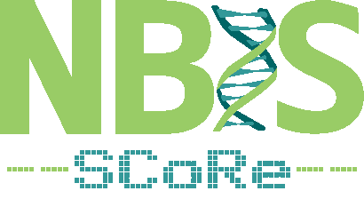
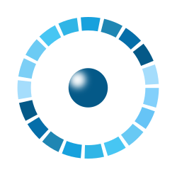

# Welcome to the SCoRe user documentation

!!! warning "This page is a stub"

    As of now, this page is incomplete, possibly incorrect and
    open for [contributions](CONTRIBUTING.md).

`[Other logos]`

The goal of SCoRe is in its name:
'Support for Computational Resources'.
This site intends to help a user find
[the resources for his/her needs](resources.md).

