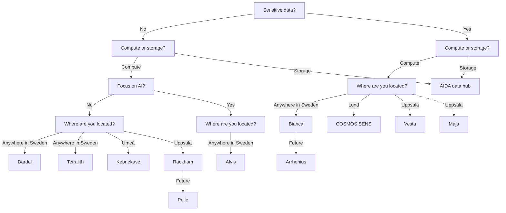

# Resources

!!! warning "This page is a stub"

    As of now, this page is incomplete, possibly incorrect and
    open for [contributions](CONTRIBUTING.md).

<!-- markdownlint-disable MD013 --><!-- Tables cannot be split up over lines, hence will break 80 characters per line -->

HPC cluster | Center(s)              | Compute type   | Compute | Storage |Type of data| Accessible for
------------|------------------------|----------------|---------|---------|------------|--------------------
Alvis       | NAISS                  | AI             | Medium  | Low     | Regular    | Swedish researchers
Bianca      | NAISS, UPPMAX          | General purpose| Medium  | Low     | Sensitive  | Swedish researchers
COSMOS      | NAISS, LUNARC          | General purpose| Medium  | Low     | Regular    | Swedish researchers
COSMOS SENS | LUNARC                 | General purpose| Medium  | Low     | Sensitive  | Lund researchers
Dardel      | NAISS, PDC             | General purpose| Medium  | Low     | Regular    | Swedish researchers
Kebnekaise  | HPC2N                  | General purpose| Medium  | Low     | Regular    | Umeå researchers
LUMI        | NAISS                  | General purpose| High    | Low     | Regular    | Swedish researchers
Rackham     | NAISS, UPPMAX          | General purpose| Medium  | Low     | Regular    | Uppsala researchers
Tetralith   | NAISS, NSC             | General purpose| Medium  | Low     | Regular    | Swedish researchers
Vera        | NSC                    | General purpose| Medium  | Low     | Regular    | Linköping researchers
Verdi       | AIDA Data Hub          | General purpose| Low     | High    | Any type   | Anyone

<!-- markdownlint-enable MD013 -->

- [AIDA Data Hub resources](https://nbisweden.github.io/aida-datahub-docs/)
- [NBIS resources](https://nbis.se/services/computational-resources)
