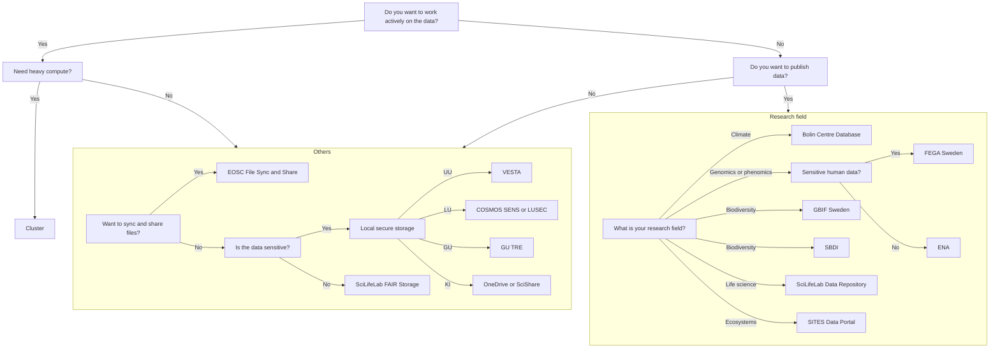

# Storage
<!-- DO NOT EDIT THIS COMPUTER GENERATED FILE. EDIT 'docs/storage_1.md' INSTEAD -->
There are multiple types of [resources](resources.md) you may need.
This page is about finding a place to store big amounts of data:
it shows a flowchart how to determine the storage resource
you can use, followed by an overview of all resources.
<!-- DO NOT EDIT THIS COMPUTER GENERATED FILE. EDIT 'docs/storage_1.md' INSTEAD -->
Before you start, you should probably do a data classification
and write a data management plan.
<!-- DO NOT EDIT THIS COMPUTER GENERATED FILE. EDIT 'docs/storage_1.md' INSTEAD -->
Further things to consider include things like keeping a backup,
versioning, etc, but the flowchart below can be a useful start.
We will happily discuss your needs and help you find something suitable.

<!-- DO NOT EDIT THIS COMPUTER GENERATED FILE. EDIT 'docs/storage_1.md' INSTEAD -->
???- question "Why is this a useful resource?"

    This page is the only page that combines all the storage resources
    of all the different providers.
<!-- DO NOT EDIT THIS COMPUTER GENERATED FILE. EDIT 'docs/storage_1.md' INSTEAD -->
???- question "How is this list generated and updated?"

    On a daily basis,
    [the `update_content.yaml` continuous integration script](https://github.com/NBISweden/SCoRe_user_doc/blob/main/.github/workflows/update_content.yaml)
    checks the websites of the course providers and updates the list,
    using [the `scoreto` R package](https://github.com/richelbilderbeek/scoreto).
<!-- DO NOT EDIT THIS COMPUTER GENERATED FILE. EDIT 'docs/storage_1.md' INSTEAD -->
???- question "A storage provider is missing!"

    If a storage provider is missing, please [contribute](CONTRIBUTING.md)
    or [contact us](contact_us.md).
<!-- DO NOT EDIT THIS COMPUTER GENERATED FILE. EDIT 'docs/storage_1.md' INSTEAD -->
???- question "My storage resource is absent!"

    If your storage resource is absent, please [contribute](CONTRIBUTING.md)
    or [contact us](contact_us.md).
<!-- DO NOT EDIT THIS COMPUTER GENERATED FILE. EDIT 'docs/storage_1.md' INSTEAD -->
???- question "My storage resource can be displayed better!"

    If your storage resource can be displayed better,
    please [contribute](CONTRIBUTING.md)
    or [contact us](contact_us.md).
<!-- DO NOT EDIT THIS COMPUTER GENERATED FILE. EDIT 'docs/storage_1.md' INSTEAD -->
???- question "How can I read this data is a machine-friendly format?"

    This information can be downloaded as a `.csv` from
    [the `scoreto` R package](https://github.com/richelbilderbeek/scoreto/blob/main/inst/extdata/storage.csv).
<!-- DO NOT EDIT THIS COMPUTER GENERATED FILE. EDIT 'docs/storage_1.md' INSTEAD -->
<!-- storage_2.md is machine-generated and -->
<!-- pasted below this file, storage_1.md -->
<!-- markdownlint-disable MD060 --><!-- The pipes must not line up -->
<!-- DO NOT EDIT THIS COMPUTER GENERATED FILE. EDIT 'docs/storage_1.md' INSTEAD -->
|HPC storage system name|Data sensitivity|Data activity|User fee|Accessible for|Center(s)|
|:----------------------------------------|:----------------|:-------------|:--------|:----------------------------------------------------------|:------|
|[Berzelius Storage](https://supr.naiss.se/resource/berzelius-storage/)|Regular          |Active        |Free       |Users of the NSC Berzelius HPC cluster                     ||
|[Bolin Centre Database](https://bolin.su.se/data)|Regular          |Any           |Free       |Climate researchers                                        ||
|[Center Storage](https://www.nsc.liu.se/support/storage/snic-centrestorage/)|Regular          |Active        |Free       |Users of the NSC HPC clusters                              ||
|[Centerstorage nobackup](https://supr.naiss.se/resource/centrestorage-nobackup-lunarc/)|Regular          |Active        |Free       |Users of the LUNARC HPC clusters                           ||
|[Crex 1](https://supr.naiss.se/resource/crex-1/)|Regular          |Active        |Free       |Users of the UPPMAX Rackham and Snowy HPC clusters         ||
|[Data Science Platform](https://datahub.aida.scilifelab.se/data-science-platform/)|Any              |Any           |[Prices](https://datahub.aida.scilifelab.se/services/#prices)|Anyone                                                     ||
|[dCache](https://supr.naiss.se/resource/dcache/)|Regular          |Active        |Free       |Swedish researchers                                        | |
|[DORIS](https://snd.se/en/doris-researchers)|Any              |Any           |Free       |Swedish researchers                                        | |
|[EOSC File Sync and Share](https://open-science-cloud.ec.europa.eu/services/file-sync-share)|Unsure           |Unknown       |Unknown    |EU citizens                                                ||
|[FEGA Sweden](https://fega.nbis.se/)     |Sensitive        |Any           |Free       |Swedish researchers working on genotype and phenotype data ||
|[GBIF Sweden](https://gbif.se/)          |Regular          |Any           |Free       |Swedish researchers working on biodiversity data           ||
|[Klemming](https://supr.naiss.se/resource/klemming/)|Regular          |Active        |Free       |Users of the PDC Dardel HPC cluster                        ||
|[Mimer](https://supr.naiss.se/resource/mimer/)|Regular          |Active        |Free       |Users of the C3SE Alvis HPC cluster                        ||
|[Nobackup](https://supr.naiss.se/resource/nobackup-hpc2n/)|Regular          |Active        |Free       |Users of the HPC2N HPC clusters                            ||
|[SciLifeLab Data Repository](https://www.scilifelab.se/)|Regular          |Any           |Free       |Swedish life science researchers                           ||
|[SITES Data Portal](https://data.fieldsites.se/portal/)|Regular          |Any           |Free       |Swedish ecosystem researchers                              ||
|[Spirula](https://supr.naiss.se/resource/spirula/)|Regular          |Active        |Free       |Swedish data-driven life science researchers               | |
|[Swedish Biodiversity Data Infrastructure](https://biodiversitydata.se/)|Regular          |Any           |Free       |Swedish researchers working on biodiversity data           ||
|[Vesta](https://www.uu.se/medarbetare/stod-och-verktyg/it/it-tjanster/tillaggstjanster/vesta)|Sensitive        |Any           |Free       |Uppsala University researchers                             ||
<!-- DO NOT EDIT THIS COMPUTER GENERATED FILE. EDIT 'docs/storage_1.md' INSTEAD -->
<!-- markdownlint-enable MD060 -->
