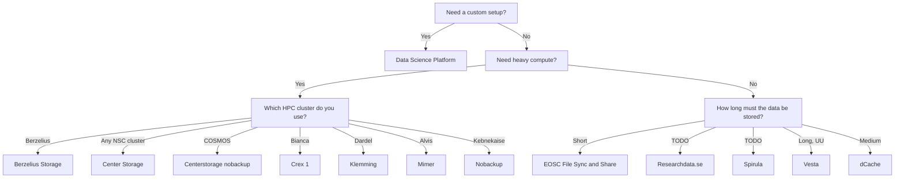

# Storage

!!! warning "This page is a stub"

    As of now, this page is incomplete, possibly incorrect and
    open for [contributions](CONTRIBUTING.md).

There are multiple types of [resources](resources.md) you may need.
This page is about finding a place to store big amounts of data:
it shows a flowchart how to determine the storage resource
you can use, followed by an overview of all resources.

## Selecting the storage resource you can use

???- question "Why is this a useful resource?"

    This page is the only page that combines all the storage resources
    of all the different providers.

???- question "How is this list generated and updated?"

    On a daily basis,
    [the `update_content.yaml` continuous integration script](https://github.com/NBISweden/SCoRe_user_doc/blob/main/.github/workflows/update_content.yaml)
    checks the websites of the course providers and updates the list,
    using [the `scoreto` R package](https://github.com/richelbilderbeek/scoreto).

???- question "A storage provider is missing!"

    If a storage provider is missing, please [contribute](CONTRIBUTING.md)
    or [contact us](contact_us.md).

???- question "My storage resource is absent!"

    If your storage resource is absent, please [contribute](CONTRIBUTING.md)
    or [contact us](contact_us.md).

???- question "My storage resource can be displayed better!"

    If your storage resource can be displayed better,
    please [contribute](CONTRIBUTING.md)
    or [contact us](contact_us.md).

???- question "How can I read this data is a machine-friendly format?"

    This information can be downloaded as a `.csv` from
    [the `scoreto` R package](https://github.com/richelbilderbeek/scoreto/blob/main/inst/extdata/storage.csv).

<!-- storage_2.md is machine-generated and pasted below this file, storage_1.md -->

|HPC storage system name|Data sensitivity|Data activity|User fee|Accessible for|Center(s)|
|:------------------------|:----------------|:-------------|:----------|:--------------------------------------------------|:-------------------|
|[Berzelius Storage](https://supr.naiss.se/resource/berzelius-storage/)|regular          |active        |Free       |Users of the NSC Berzelius HPC cluster             ||
|[Center Storage](https://www.nsc.liu.se/support/storage/snic-centrestorage/)|regular          |active        |Free       |Users of the NSC HPC clusters                      ||
|[Centerstorage nobackup](https://supr.naiss.se/resource/centrestorage-nobackup-lunarc/)|regular          |active        |Free       |Users of the LUNARC HPC clusters                   ||
|[Crex 1](https://supr.naiss.se/resource/crex-1/)|regular          |active        |Free       |Users of the UPPMAX Rackham and Snowy HPC clusters ||
|[Data Science Platform](https://datahub.aida.scilifelab.se/data-science-platform/)|any              |any           |[Prices](https://datahub.aida.scilifelab.se/services/#prices)|Anyone                                             ||
|[dCache](https://supr.naiss.se/resource/dcache/)|regular          |active        |Free       |Swedish researchers                                | |
|[EOSC File Sync and Share](https://open-science-cloud.ec.europa.eu/services/file-sync-share)|Unsure           |Unknown       |Unknown    |EU citizens                                        ||
|[Klemming](https://supr.naiss.se/resource/klemming/)|regular          |active        |Free       |Users of the PDC Dardel HPC cluster                ||
|[Mimer](https://supr.naiss.se/resource/mimer/)|regular          |active        |Free       |Users of the C3SE Alvis HPC cluster                ||
|[Nobackup](https://supr.naiss.se/resource/nobackup-hpc2n/)|regular          |active        |Free       |Users of the HPC2N HPC clusters                    ||
|[Researchdata.se](https://researchdata.se)|Any              |Any           |Free       |EU citizens                                        ||
|[Spirula](https://supr.naiss.se/resource/spirula/)|regular          |active        |Free       |Swedish data-driven life science researchers       | |
|[Vesta](https://www.uu.se/medarbetare/stod-och-verktyg/it/it-tjanster/tillaggstjanster/vesta)|sensitive        |any           |Free       |Uppsala University researchers                     ||
