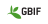

|HPC storage system name|Data sensitivity|Data activity|User fee|Accessible for|Center(s)|
|:----------------------------------------|:----------------|:-------------|:----------|:----------------------------------------------------------|:---------------------|
|[Berzelius Storage](https://supr.naiss.se/resource/berzelius-storage/)|regular          |active        |Free       |Users of the NSC Berzelius HPC cluster                     ||
|[Bolin Centre Database](https://bolin.su.se/data)|Regular          |Any           |Free       |Climate researchers                                        ||
|[Center Storage](https://www.nsc.liu.se/support/storage/snic-centrestorage/)|regular          |active        |Free       |Users of the NSC HPC clusters                              ||
|[Centerstorage nobackup](https://supr.naiss.se/resource/centrestorage-nobackup-lunarc/)|regular          |active        |Free       |Users of the LUNARC HPC clusters                           ||
|[Crex 1](https://supr.naiss.se/resource/crex-1/)|regular          |active        |Free       |Users of the UPPMAX Rackham and Snowy HPC clusters         ||
|[Data Science Platform](https://datahub.aida.scilifelab.se/data-science-platform/)|any              |any           |[Prices](https://datahub.aida.scilifelab.se/services/#prices)|Anyone                                                     ||
|[dCache](https://supr.naiss.se/resource/dcache/)|regular          |active        |Free       |Swedish researchers                                        | |
|[DORIS](https://snd.se/en/doris-researchers)|Any              |Any           |Free       |Swedish researchers                                        | |
|[EOSC File Sync and Share](https://open-science-cloud.ec.europa.eu/services/file-sync-share)|Unsure           |Unknown       |Unknown    |EU citizens                                                ||
|[FEGA Sweden](https://fega.nbis.se/)     |Sensitive        |Any           |Free       |Swedish researchers working on genotype and phenotype data ||
|[GBIF Sweden](https://gbif.se/)          |Regular          |Any           |Free       |Swedish researchers working on biodiversity data           ||
|[Klemming](https://supr.naiss.se/resource/klemming/)|regular          |active        |Free       |Users of the PDC Dardel HPC cluster                        ||
|[Mimer](https://supr.naiss.se/resource/mimer/)|regular          |active        |Free       |Users of the C3SE Alvis HPC cluster                        ||
|[Nobackup](https://supr.naiss.se/resource/nobackup-hpc2n/)|regular          |active        |Free       |Users of the HPC2N HPC clusters                            ||
|[SciLifeLab Data Repository](https://www.scilifelab.se/)|Regular          |Any           |Free       |Swedish life science researchers                           ||
|[SITES Data Portal](https://data.fieldsites.se/portal/)|Regular          |Any           |Free       |Swedish ecosystem researchers                              ||
|[Spirula](https://supr.naiss.se/resource/spirula/)|regular          |active        |Free       |Swedish data-driven life science researchers               | |
|[Swedish Biodiversity Data Infrastructure](https://biodiversitydata.se/)|Regular          |Any           |Free       |Swedish researchers working on biodiversity data           ||
|[Vesta](https://www.uu.se/medarbetare/stod-och-verktyg/it/it-tjanster/tillaggstjanster/vesta)|sensitive        |any           |Free       |Uppsala University researchers                             ||
