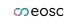

 [1] "<!-- markdownlint-disable MD060 --><!-- The pipes must not line up -->"                                                                                                                                                                                                                      
 [2] ""                                                                                                                                                                                                                                                                                            
 [3] "|HPC storage system name|Data sensitivity|Data activity|User fee|Accessible for|Center(s)|"                                                                                                                                                                                                  
 [4] "|:----------------------------------------|:----------------|:-------------|:--------|:----------------------------------------------------------|:------|"                                                                                                                                  
 [5] "|[Berzelius Storage](https://supr.naiss.se/resource/berzelius-storage/)|Regular          |Active        |Free       |Users of the NSC Berzelius HPC cluster                     ||"                                                                         
 [6] "|[Bolin Centre Database](https://bolin.su.se/data)|Regular          |Any           |Free       |Climate researchers                                        ||"                                                            
 [7] "|[Center Storage](https://www.nsc.liu.se/support/storage/snic-centrestorage/)|Regular          |Active        |Free       |Users of the NSC HPC clusters                              ||"                                                                   
 [8] "|[Centerstorage nobackup](https://supr.naiss.se/resource/centrestorage-nobackup-lunarc/)|Regular          |Active        |Free       |Users of the LUNARC HPC clusters                           ||"                                                  
 [9] "|[Crex 1](https://supr.naiss.se/resource/crex-1/)|Regular          |Active        |Free       |Users of the UPPMAX Rackham and Snowy HPC clusters         ||"                                                                                        
[10] "|[Data Science Platform](https://datahub.aida.scilifelab.se/data-science-platform/)|Any              |Any           |[Prices](https://datahub.aida.scilifelab.se/services/#prices)|Anyone                                                     ||"
[11] "|[dCache](https://supr.naiss.se/resource/dcache/)|Regular          |Active        |Free       |Swedish researchers                                        | |"                                              
[12] "|[DORIS](https://snd.se/en/doris-researchers)|Any              |Any           |Free       |Swedish researchers                                        | |"                                                     
[13] "|[EOSC File Sync and Share](https://open-science-cloud.ec.europa.eu/services/file-sync-share)|Unsure           |Unknown       |Unknown    |EU citizens                                                ||"                                                 
[14] "|[FEGA Sweden](https://fega.nbis.se/)     |Sensitive        |Any           |Free       |Swedish researchers working on genotype and phenotype data ||"                                                                                      
[15] "|[GBIF Sweden](https://gbif.se/)          |Regular          |Any           |Free       |Swedish researchers working on biodiversity data           ||"                                                                                                    
[16] "|[Klemming](https://supr.naiss.se/resource/klemming/)|Regular          |Active        |Free       |Users of the PDC Dardel HPC cluster                        ||"                                                                                           
[17] "|[Mimer](https://supr.naiss.se/resource/mimer/)|Regular          |Active        |Free       |Users of the C3SE Alvis HPC cluster                        ||"                                                                                              
[18] "|[Nobackup](https://supr.naiss.se/resource/nobackup-hpc2n/)|Regular          |Active        |Free       |Users of the HPC2N HPC clusters                            ||"                                                                                 
[19] "|[SciLifeLab Data Repository](https://www.scilifelab.se/)|Regular          |Any           |Free       |Swedish life science researchers                           ||"                                                                               
[20] "|[SITES Data Portal](https://data.fieldsites.se/portal/)|Regular          |Any           |Free       |Swedish ecosystem researchers                              ||"                                                                                    
[21] "|[Spirula](https://supr.naiss.se/resource/spirula/)|Regular          |Active        |Free       |Swedish data-driven life science researchers               | |"                                            
[22] "|[Swedish Biodiversity Data Infrastructure](https://biodiversitydata.se/)|Regular          |Any           |Free       |Swedish researchers working on biodiversity data           ||"                                                                     
[23] "|[Vesta](https://www.uu.se/medarbetare/stod-och-verktyg/it/it-tjanster/tillaggstjanster/vesta)|Sensitive        |Any           |Free       |Uppsala University researchers                             ||"                                           
[24] ""                                                                                                                                                                                                                                                                                            
[25] "<!-- markdownlint-enable MD060 -->"                                                                                                                                                                                                                                                          
