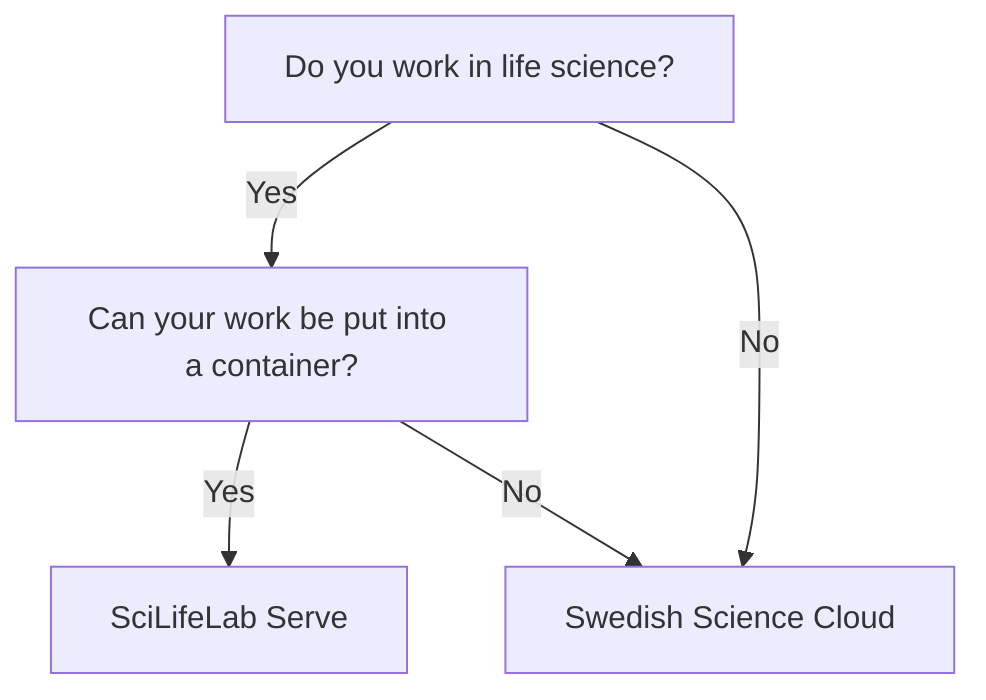

# Web host

There are multiple types of [resources](resources.md) you may need.
This page is about a place to host a website:
it shows a flowchart how to determine the resource
you can use, followed by an overview of all resources.

## Selecting the right resource

???- question "How is this list generated and updated?"

    On a daily basis,
    [the `update_content.yaml` continuous integration script](https://github.com/NBISweden/SCoRe_user_doc/blob/main/.github/workflows/update_content.yaml)
    checks the websites of the course providers and updates the list,
    using [the `scoreto` R package](https://github.com/richelbilderbeek/scoreto).

???- question "My web hosting resource is absent!"

    If your web hosting resource is absent, please [contribute](CONTRIBUTING.md)
    or [contact us](contact_us.md).

???- question "My web hosting resource can be displayed better!"

    If your web hosting resource can be displayed better,
    please [contribute](CONTRIBUTING.md)
    or [contact us](contact_us.md).

???- question "How can I read this data is a machine-friendly format?"

    <!-- markdownlint-disable MD013 --><!-- URLs cannot be split up over lines, hence will break 80 characters per line -->

    This information can be downloaded as a `.csv` from
    [the `scoreto` R package](https://github.com/richelbilderbeek/scoreto/blob/main/inst/extdata/web host.csv).

    <!-- markdownlint-enable MD013 -->

<!-- web_host_2.md is machine-generated -->
<!-- and pasted below this file, web_host_1.md -->
