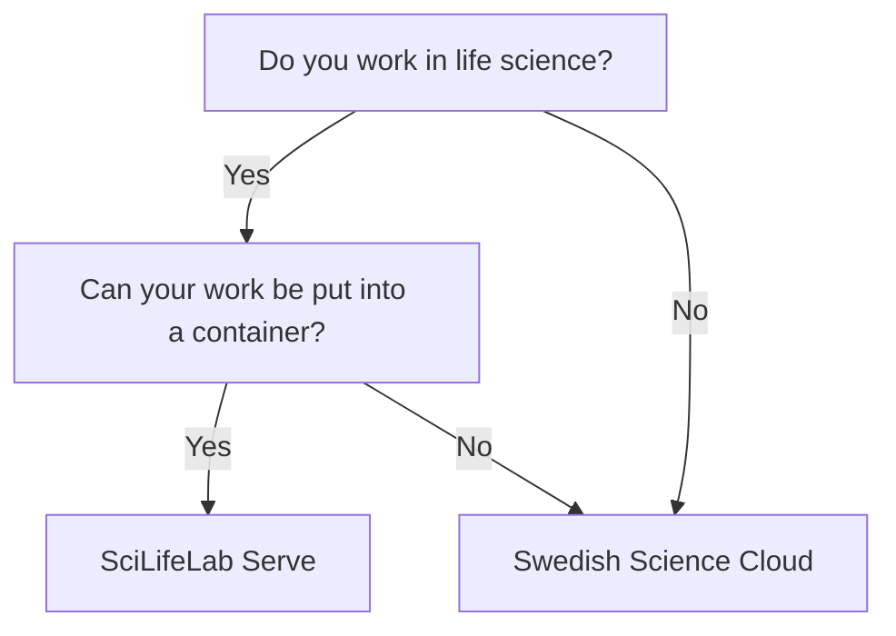

# Web host

!!! warning "This page is a stub"

    As of now, this page is incomplete, possibly incorrect and
    open for [contributions](CONTRIBUTING.md).

There are multiple types of [resources](resources.md) you may need.
This page is about a place to host a website:
it shows a flowchart how to determine the resource
you can use, followed by an overview of all resources.

## Selecting the right resource

## Overview of resources

<!-- web_host_2.md is machine-generated and pasted below this file, web_host_1.md -->
