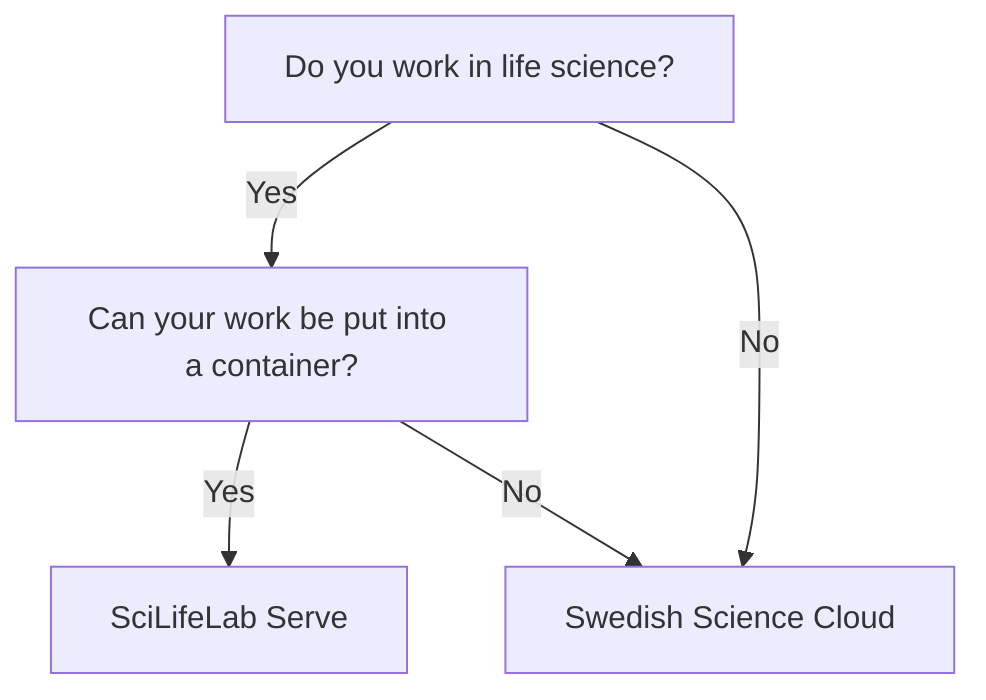

# Website

!!! warning "This page is a stub"

    As of now, this page is incomplete, possibly incorrect and
    open for [contributions](CONTRIBUTING.md).

There are multiple types of [resources](resources.md) you may need.
This page is about a place to host a website:
it shows a flowchart how to determine the resource
you can use, followed by an overview of all resources.

## Selecting the right resource

## Overview of resources

<!-- markdownlint-disable MD013 --><!-- Tables cannot be split up over lines, hence will break 80 characters per line -->

Resource                                        | Center(s)              | Resource type   | Compute | Storage |Type of data        | Costs for user | Accessible for
------------------------------------------------|------------------------|-----------------|---------|---------|--------------------|----------------|------
[Swedish Science Cloud](https://cloud.snic.se/) | NAISS                  | Website         | Low     | Low     | Regular            | Free           | Swedish researchers
[SciLifeLab Serve](https://serve.scilifelab.se/)| SciLifeLab             | Website         | Low     | Low     | Regular            | Free           | Life science scientists

<!-- markdownlint-enable MD013 -->

